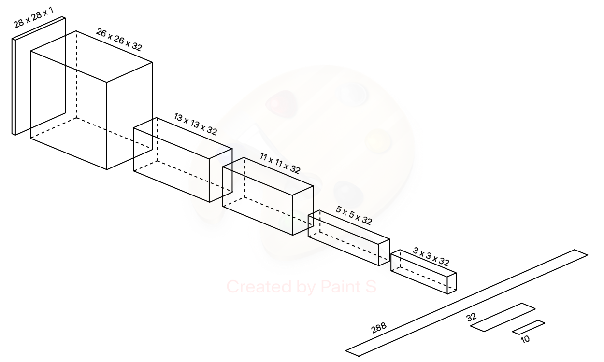

```{r setup, include=FALSE}
library(keras)
library(dplyr)
library(ggplot2)
library(tinytex)
library(knitr)
load("workspace.RData")
```

# Overview

This project aimed to introduce a convolution neural network (CNN) model on the fashion mnist dataset, and to show that CNN is capable to recognize more patterns than artificial neural network (ANN). The fashion mnist dataset is a dataset released by the [Zalando Research](https://research.zalando.com/) team and their goal is to create a direct drop-in replacement of the traditional mnist dataset. Traditional mnist is so popular for a long time and it is widely used by researchers for benchmarking. There are tremendous amount of well designed models work extremely well (\~100%) on mnist. The fashion mnist dataset is similar to the traditional mnist dataset (28x28 pixels, 10 categories) but it is a lot more difficult to predict because the images are more complicated and similarly to each other. The final product of this project is a CNN tuned by fashion mnist dataset, and a comparison table to compare the performances of an ANN and the best tuned CNN, on both fashion mnist and traditional mnist datasets, to show that CNN could capture more patterns than ANN.

# R version and Machine used

    - R version 4.0.4
    - Macbook Air (13-inch, Early 2015)

# Dataset

The fashion mnist dataset is obtainable at [\textcolor{blue}{Kaggle}](https://www.kaggle.com/zalando-research/fashionmnist). It is a dataset with 60000 (train) + 10000 (validate) = 70000 (total) Zalando's article images. All images are of the same dimension (28 x 28 pixels) and they are categorized into 10 categories, similar to the mnist dataset (digit 0-9).

Below are the 10 categories and 4 sample images from the dataset:

| levels | category    |
|--------|-------------|
| 0      | T-shirt/top |
| 1      | Trouser     |
| 2      | Pullover    |
| 3      | Dress       |
| 4      | Coat        |
| 5      | Sandal      |
| 6      | Shirt       |
| 7      | Sneaker     |
| 8      | Bag         |
| 9      | Ankle boot  |

```{r plot_1_1, echo=FALSE, fig.height = 6, fig.width = 6, message=FALSE}
par(mfrow = c(2,2))
image(matrix(as.numeric(mnist_f_train_dat[43,2:785]),28,28), main = as.numeric(mnist_f_train_dat[43,1]))
image(matrix(as.numeric(mnist_f_train_dat[143,2:785]),28,28), main = as.numeric(mnist_f_train_dat[143,1]))
image(matrix(as.numeric(mnist_f_train_dat[437,2:785]),28,28), main = as.numeric(mnist_f_train_dat[437,1]))
image(matrix(as.numeric(mnist_f_train_dat[5413,2:785]),28,28), main = as.numeric(mnist_f_train_dat[5413,1]))
```

According to Zalando Research, they seek to replace mnist dataset by the fashion_mnist dataset. This is good news for those who want to benchmark their image recognition algorithms, for instance, CNN. The reason is that modern image recognition techniques can easily predict the traditional mnist up to \~99% accuracy, the room to improve such models is limited. If the traditional mnist is replaced by the fashion mnist, the model accuracy could easily drop below 90%, which provides a lot more room to improve.

## Artificial Neural Network on fashion_mnist and mnist

To compare the predictability of mnist and fashion_mnist, the following regularized ANN is useful:

```{r model_mnist_f_NN, include=TRUE}
load_model_hdf5("model_mnist_f_NN.h5")
```

The model performance on the two datasets are:

```{r plot_history_mnist_f_NN, echo=FALSE, fig.height = 3.5, fig.width = 5, message=FALSE}
plot_history_mnist_f_NN
```

```{r plot_history_mnist_NN, echo=FALSE, fig.height = 3.5, fig.width = 5, message=FALSE}
plot_history_mnist_NN
```

The accuracy is `r tail(history_mnist_f_NN$metrics$val_accuracy,1)` on the fashion_mnist dataset but the accuracy is `r tail(history_mnist_NN$metrics$val_accuracy,1)` on the mnist dataset. The performances differ because of the amount of noise, the variety within a single category and the similarity between two or more categories. The below comparison shows how subtle the differences between Shirt, Coat and Pullover could be:

```{r similarity, echo=FALSE, fig.height = 2.5, fig.width = 6.5, message=FALSE}
par(mfrow = c(1,3))
image(matrix(as.numeric(mnist_f_train_dat[75,2:785]),28,28), main = as.numeric(mnist_f_train_dat[75,1]))
image(matrix(as.numeric(mnist_f_train_dat[78,2:785]),28,28), main = as.numeric(mnist_f_train_dat[78,1]))
image(matrix(as.numeric(mnist_f_train_dat[86,2:785]),28,28), main = as.numeric(mnist_f_train_dat[86,1]))
```

Since ANN "observes" the input as a whole picture, subtle patterns are more difficult to detect. CNN on the other hand is more appropriate because the key difference between ANN and CNN is that CNN recognizes images by locating translational invariable local patterns.

# Convolution Neural Network

This section outlined the base CNN for this project, and the next section will be the model tuning base on this base model. The general idea of CNN is:

    - Feed the image to the first convolution layer
    - The first convolution layer produces response maps by using filters (containing the parameters)
    - Transform the output to reduce dimensions
    - The second convolution layer reads the transformed output and perform similar convolution processes
    - Transform the output to reduce dimensions
    - Repeat until the last convolution layer
    - Flatten the output of the last convolution layer
    - Feed the flattened output to an ANN and predict
    - Perform regularization
    - Minimize the loss by updating the parameters to reduce loss and iterate until the metric converges

## Data Preprocessing

Similar to traditional mnist, the range of the pixels is [0,255] which is not ideal for neither ANN or CNN because it could slow down the model run and defer the convergence. Therefore, all the pixels are normalized to have range [0,1].

## Model structure

Let's look at this basic CNN and adjust the model later:
```{r mnist_f_CNN_no_reg, include=TRUE}
load_model_hdf5("mnist_f_CNN_no_reg.h5")
```
{width=80%}

The input of the CNN model would be a *tensor* with shape [1:60000, 1:28, 1:28, 1] which means a collection of 60000 28 x 28 fashion images with 1 color scale (grayscale).

### First convolution layer

    - layer_conv_2d(filters = 32, 
                    kernel_size = c(3,3),
                    activation = "relu", input_shape = c(28,28,1))

The first layer of the model is a conv_2d, a convolution layer using 32 filters with *kernel* size 3x3 and activation ReLU (to floor the output of the node by 0). The process of conv_2d is to *"slide"* each *filter* through the input (image), store the calculated dot products in the output called *channel*.

> ***tensor***: In Keras, tensor is the standard input/output format of a nerual network layer. Scalars are 0D tensor, vectors (collections of scalars) are 1D tensor, matrices (collections of vectors) are 2D tensor, collections of matrices are 3D tensor, collections of collections of matrices are 4D tensors, and so on.

> ***kernel***: A kernel in a CNN is usually a 3x3 or 4x4 matrix containing the weights to be estimated.

> ***filter***: A filter is a stack of n kernel(s), where n is the number of *channels* of the input. When n=1, a filter is equivalent to a kernel.

> ***channel***: A channel could mean the number of color channels that an image has, it could also mean the number of *response maps* in a certain conv_2d output.

> ***response map***: A response map is the product of *sliding* a filter. The number of response maps in the output depends on the number of filters used.

{width=100%}

> ***slide***: When a conv_2d layer "slides" a filter through the input, all the dot products at a certain position are being calculated. The number of dot products at a certain position depends on the number of kernels in a filter (also equal the number of input channels). For example, if the input is of dimension 100x100x3 and the filter is of dimension 3x3x3, there are 3 dot products for each position. The first dot product is the dot product between the first kernel (filter[1,,]) and the 3x3 "corner" of the first channel (input[1,1:3,1:3]), the second dot product is the dot product between the second kernel (filter[2,,]) and the *same* 3x3 "corner" of the second channel (input[2,1:3,1:3]), and similarly for the third dot product. The products are then being added together and stored as an element in a matrix. After sliding the filter through all positions, this matrix will be completed and is called a response map corresponds to this filter. The conv_2d finishes its work by sliding all filters through all positions. 

For this first layer, the input is an image of dimension 28x28x1, i.e. 28 pixels by 28 pixels, 1 color channel. Since there is only one channel in the input and the dimension of the kernel is 3x3, the dimension of the each filter would be 3x3x1. Imagine the 3x3x1 filter is a solid block and the input is a 28x28x1 hollow box, the allowed range to slide is 26x26. Therefore, the dimension of the output is 26x26x1 instead of 28x28x1 because of the boundary condition.

The output of sliding 1 filter is of dimension 26x26x1. This convolution layer uses 32 filters so the output would be 26x26x32.

### First maxpooling layer

    - layer_max_pooling_2d(pool_size = c(2,2))

Maxpooling is an action to remove less significant features by taking only the maximum value out of all 2x2 non-overlapping "pools" on each channel. For example, if a channel is a 4x4 matrix, the output of maxpooling on it would be a 2x2 matrix:

Input:

```{r maxpooli, echo=FALSE}
print(matrix(1:16,4,4))
```

Output:

```{r maxpoolo, echo=FALSE}
print(matrix(c(6,8,14,16),2,2))
```

Since the output of the first layer is of dimension 26x26x32, this maxpooling layer will perform on each of the 32 channels and output a 13x13x1 for each channel, resulting in a 13x13x32 output.

### Second convolution layer

    - layer_conv_2d(filters = 32, 
                    kernel_size = c(3,3),
                    activation = "relu")

The second layer of the model is again a conv_2d. Although the setup is the same as the first convolution layer, the input shape is the output shape of the previous layer, i.e. 13x13x32. Therefore, the filters used in this convolution layer is of dimension 3x3x32 where 3x3 is the kernel dimension and 32 is the number of channels of the input. Using the same understanding described in the first layer, the output shape of this layer is 11x11x32.

### Second maxpooling layer

    - layer_max_pooling_2d(pool_size = c(2,2))

The maxpooling process is the same as previously described. If the dimension is an odd number, i.e. 11, the output dimension would be the largest integer less than half of the input dimension, i.e. 5, since 5 is the largest integer less than 11/2=5.5. The output shape is 5x5x32.

### Third convolution layer

    - layer_conv_2d(filters = 32, 
                    kernel_size = c(3,3),
                    activation = "relu")

The same convolution process applies here. The output dimension is 3x3x32.

### Flatten the tensor

    - layer_flatten()

The next step is to feed the 3x3x32 output to an ANN. Since ANN only reads 1D tensor, the output of the last layer has to be flattened from 3x3x32 to a 1D tensor (vector), here the length is 3x3x32=288.

### First dense layer

    - layer_dense(units = 32, activation = "relu") %>%

This is a standard dense hidden layer of ANN with 32 nodes. It reads input vector of length 288 and output vector of length 32. The activation here is ReLU which is max(x,0) to make sure the output is non-negative, i.e. floor at 0.

### Softmax layer

    - layer_dense(units = 10, activation = "softmax")

This dense layer is the last layer, with softmax activation. Softmax activation transform input into the probabilities of the input image being any one of the 10 categories. The sum of these values would be 1 and the prediction of the model would be the category with the highest probability.

## Optimizer, Loss function and Metrics

    - model %>% compile(optimizer = "rmsprop", loss = "categorical_crossentropy", metrics = c("accuracy"))

Deep learning is about finding the best set of parameters by minimizing the overall loss through iterations. Therefore, a defined loss function is necessary for the model to calculate and minimize loss; an optimizer is necessary to instruct the model how to tune the parameters after each iteration, and a metric as the performance measure of the model.

    - optimizer = "rmsprop"

Optimizer "rmsprop" means gradient descent, it is a common and safe choice for deep learning models. On a 2D cartesian plane, differentiate a function $y=f(x)$ at a point $(x_0,y_0)$ returns the slope of tangent at $x=x_0$. If the slope is positive, decrease in x ($-$, opposite direction to the $+$ slope) would result in a decrease in $f(x)$. On a 3D cartesian space, $z=f(x,y)$ could be visualized as a surface. If $(x_0,y_0,z_0)$ is a point on the surface, $z_0=f(x_0,y_0)$ is the "height" of the point and it is dependent on the value of $x_0$ and $y_0$, i.e. values $x$ and $y$ drive $z$ up and down. Unlike the 2D case, the differentiation of a function is now called the gradient and it could be written as $\nabla f(x_0,y_0) = \Big(\frac{\partial f}{\partial x}, \frac{\partial f}{\partial y}\Big)\Big|_{(x_0,y_0)}$. It is a vector with direction pointing to the maximum of $f$. Therefore, to minimize (descent) f from point $(x_0,y_0)$, one needs to move opposite to the gradient vector direction. The same rationale also applies to dimensions high than 3. Gradient descent in deep learning algorithm do such minimization by letting f be the loss and the independent variables to be the parameters. The magnitude of the update in each iteration differs by optimizers, here rmsprop updates the parameters by a fraction (learning rate divided by the squared root of moving average of recent gradient magnitudes) of the gradient.

    - loss = "categorical_crossentropy"

Loss function is a function to calculate loss given the prediction and the true value. For classification problem, the model output is a probability distribution containing information on how likely is the input being each of the category. Cross entropy is a common function to use in this case because it does not only push the model to predict well, it also pushes the model to estimate a better probability distribution to minimize the number of "merely correct" cases. For regression problem on the other hand, mean squared error is a common loss function to use.

    - metrics = c("accuracy")

We need a metric to assess how good a model performs. For some problems, such as healthcare prescreening tests, accuracy is not the first metric to look at because prescreening should emphasize high recall (or true positive rate). You do not want to screen out actually sick patients as negative (not ill) because that will stop them to participate in further tests or treatments. For such problem, recall should be the metric, the higher the recall the better the model. On the other hand, an image classification problem like this project, accuracy is the most suitable metric.

## Train and run the model

    - history_cnn_no_reg <- model %>% fit(mnist_f_train_images, 
                                          mnist_f_train_labels, 
                                          validation_data = list(mnist_f_test_images, 
                                                                 mnist_f_test_labels), 
                                          epochs = 20, 
                                          batch_size = 64)

The algorithm processes mini batches of images (one batch processed = one iteration completed) in a single epoch until all images are being processes. For example if batch=64 (64 images in one mini batch) and the total number of images is 60000, there would be roundup(60000/64)=938 mini batches to process, i.e. 938 iterations in a single epoch. Here we set epochs=20 to let the model processes the whole dataset 20 times.

## Regularization to fight overfitting

After running the model, the most undesirable situation appeared:

```{r history_cnn_no_reg, fig.height = 2.5, fig.width = 4, echo=FALSE, message=FALSE}
plot(history_cnn_no_reg) + ggtitle("CNN without regularization")
```

This could be the most common problem of predictive models called "overfitting". One can see the prediction on the training dataset is consistently better than the prediction on the hold-out validation dataset. This is because the model have learn a lot of features specific to the training dataset and not general enough to predict new data. A well built model should be trained by the training dataset but performs similarly on both the training AND the validation dataset. Only in this way can we expect the model has a certain accuracy when predicting a new data point. To obtain such model, regularization is needed such that the model does not over train and dive too deep on the training dataset. The techniques are dropout and L2 regularization.

> ***Dropout***: Randomly remove nodes during the learning process. This could prevent co-adaptation such that not only strong features are being learnred but also weaker ones. Dropout rate 0.5 means any nodes will have 50% probability to be dropped out.

> ***L2 regularization***: Regularize the estimated weights such that they are not over significant through over learning. The way is to add penalty to the loss proportional to the squared estimated weights. The L2 stands for L2-norm which is a term in linear algebra means distance. The model with L2 regularization will then only take small values for all weights because the model has to minimizie the penalty to minimize the loss.

It is worth to mention that there is another technique called *data augmentation*. It expands the existing training dataset by rotating, shifting, shearing, zooming, fliping the existing images. This technique usually applies when there is not enough training images. 

After applying the dropout and L2 regularization, the model performance is more consistent on both training and validation datasets:

```{r regularize, fig.height = 2.5, fig.width = 4, echo=FALSE, message=FALSE}
plot(history_cnn_dropout) + ggtitle("CNN with dropout")
plot(history_cnn_dropout_L2) + ggtitle("CNN with both dropout and L2")
```

In conclusion, the base model is the following with accuracy `r tail(history_cnn_dropout_L2$metrics$val_accuracy,1)`.

```{r mnist_f_CNN_dropout_L2, INCLUDE=TRUE}
load_model_hdf5("mnist_f_CNN_dropout_L2.h5")
```

# Model Tuning

There are rooms to improve the model by changing the number of layers, the number of filters, the number of nodes in the dense layer. The base model has 3 convolution layers and each of them can have different number of filters. The numbers of filters in the layers are usually non-decreasing. In the base model, the first layer has 32 filters, both second and third layer have 64 filters. The dense layer which will learn from the flattened output of the last convolution layer has at least the same amount of nodes as the input.

The result, from highest to lowest accuracy, is:

```{r 3_layer_tuneGrid, INCLUDE=TRUE}
kable(tuneGridResult %>% select(-runtime_mins) %>% arrange(desc(accuracy)))
```

The highest accuracy achieved by a 3-layer model is `r max(tuneGridResult$accuracy)` where the number of filters used for each layer are `r tuneGridResult$layer1[which.max(tuneGridResult$accuracy)]`, `r tuneGridResult$layer2[which.max(tuneGridResult$accuracy)]` and `r tuneGridResult$layer3[which.max(tuneGridResult$accuracy)]` for layer 1, layer 2 and layer 3 respectively. The dense layer has `r tuneGridResult$layerdense[which.max(tuneGridResult$accuracy)]` nodes.

Since there is no rules of thumb to determine how many layers or how many filters should be used in a CNN, we should test whether 3 convolution layers are too many for 28x28 images. Similar tuneGrids for 2-layer models and 1-layer models are:

```{r 2and1_layer_tuneGrid, INCLUDE=TRUE}
kable(tuneGridResult2layer %>% select(-runtime_mins) %>% arrange(desc(accuracy)), caption="2-layer")
kable(tuneGridResult1layer %>% select(-runtime_mins) %>% arrange(desc(accuracy)), caption="1-layer")
```

We can see that overall 1-layer and 3-layer models are inferior to the 2-layer models. The [mean(accuracy),sd(accuracy)] of 1-layer, 2-layer and 3-layer models are [`r mean(tuneGridResult1layer$accuracy)`,`r sd(tuneGridResult1layer$accuracy)`],[`r mean(tuneGridResult2layer$accuracy)`,`r sd(tuneGridResult2layer$accuracy)`] and [`r mean(tuneGridResult$accuracy)`,`r sd(tuneGridResult$accuracy)`] respectively. It is safe to use a 2-layer model as the final model. Among the 2-layer models, the best one has accuracy `r max(tuneGridResult2layer$accuracy)`. It is a 2-layer CNN with `r tuneGridResult2layer$layer1[which.max(tuneGridResult2layer$accuracy)]` filters in the first layer and `r tuneGridResult2layer$layer2[which.max(tuneGridResult2layer$accuracy)]` filters in the second layer. The dense layer has `r tuneGridResult2layer$layerdense[which.max(tuneGridResult2layer$accuracy)]` nodes. 

The final CNN is:
```{r finalCNN, include=TRUE}
load_model_hdf5("model_CNN_best_tuned.h5")
```

# Conclusion

The ANN and best-tuned CNN performances on traditional mnist and fashion mnist are:

```{r conclusion_compare, include=TRUE}
kable(compare)
```

This shows that the fashion_mnist dataset is a lot more difficult to predict because the CNN accuracy dropped by `r -compare[2,3]` (from `r compare[2,1]` to `r compare[2,2]`) and the ANN accuracy dropped by `r -compare[1,3]` (from `r compare[1,1]` to `r compare[1,2]`). The performance of ANN on traditional mnist is worse than CNN by `r compare[3,1]` but it is even worse (by `r compare[3,2]`) on the fashion mnist dataset. This shows that images in fashion mnist are having more subtle details that ANN is not that capable to recognize. CNN on the other hand could handle such subtle details better and boost the accuracy up above 90%.
